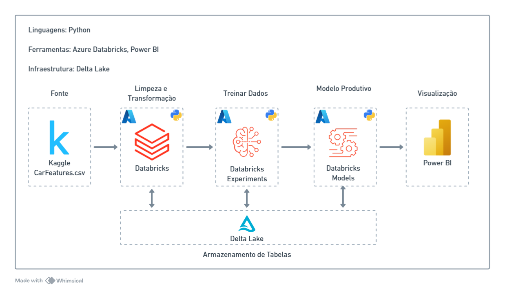
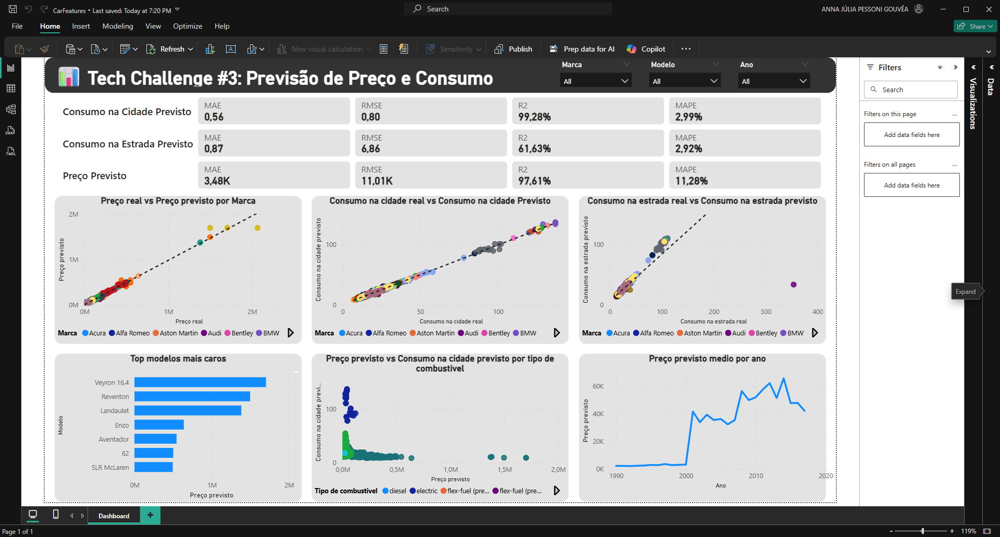

# 🚗 PosTechChallenge3 - Car Features Prediction

## 📖 Sobre o Projeto
Este projeto foi desenvolvido para processar um dataset de características de carros e utilizá-lo para criar modelos de regressão de machine learning que preveem resultados do preço de um carro, consumo de combustível na estrada e na cidade com base em suas características. Ele inclui etapas de limpeza de dados, visualização, treinamento de modelos, validação e pipelines de implantação.

### 🧩 Arquitetura



### 📂 Estrutura do Projeto

- **datasets/**: Contém os dados de entrada, dados processados intermediários e as previsões geradas.
  - `input/car_features.csv`: O conjunto de dados bruto com características dos carros.
  - `read_source_csv.ipynb`: Notebook para leitura e exploração dos dados CSV.
  - `clean_source_table.ipynb`: Notebook para limpeza dos dados brutos.

- **data_visualization/**: Contém arquivos do Power BI para visualização dos dados.
  - `CarFeatures.pbix`: Arquivo do Power BI para visualização dos dados.

- **mlops/**: Contém o pipeline de MLOps para treinamento, validação e implantação.
  - **deployment/**:
    - `predict.py`: Script para realizar previsões usando os modelos treinados.
    - `notebooks/BatchInference.ipynb`: Notebook para inferência em lote.
  - **jobs/**:
    - `job_config.json.template`: Template para configuração de jobs.
    - `predict_job_config.json`: Configuração para jobs de previsão.
    - `train_job_config.json`: Configuração para jobs de treinamento.
  - **training/**:
    - `notebooks/Train.ipynb`: Notebook para treinamento dos modelos.
  - **validation/**:
    - `validate.py`: Script para validação dos modelos.

- **models/**: Contém os modelos de IA e análises relacionadas.
  - `carfeatures_linear_regression.ipynb`: Notebook para treinamento de um modelo de regressão linear.
  - `carfeatures_xgboost.ipynb`: Notebook para treinamento de um modelo XGBoost.
  - `carfeatures.ipynb`: Notebook geral para experimentação com modelos.
  - **analysis/**:
    - `analises.ipynb`: Notebook para análise dos resultados dos modelos.
    - `plots.ipynb`: Notebook para geração de gráficos.

### 🗄️ Tabelas do Banco de Dados

O projeto utiliza as seguintes tabelas para armazenar e processar os dados:

- `car_features_raw`: Contém os dados brutos extraídos do arquivo **car_features.csv**.

    | Column            | Type    |
    |-------------------|---------|
    | make              | string  |
    | model             | string  |
    | year              | bigint  |
    | engine_fuel_type  | string  |
    | engine_hp         | double  |
    | engine_cylinders  | double  |
    | transmission_type | string  |
    | driven_wheels     | string  |
    | number_of_doors   | double  |
    | market_category   | string  |
    | vehicle_size      | string  |
    | vehicle_style     | string  |
    | highway_mpg       | bigint  |
    | city_mpg          | bigint  |
    | popularity        | bigint  |
    | msrp              | bigint  |
- `car_features`: Contém os dados limpos e processados a partir da tabela **car_features_raw**.

    | Column            | Type    |
    |-------------------|---------|
    | make              | string  |
    | model             | string  |
    | year              | bigint  |
    | engine_fuel_type  | string  |
    | engine_hp         | double  |
    | engine_cylinders  | double  |
    | transmission_type | string  |
    | driven_wheels     | string  |
    | number_of_doors   | double  |
    | market_category   | string  |
    | vehicle_size      | string  |
    | vehicle_style     | string  |
    | highway_mpg       | bigint  |
    | city_mpg          | bigint  |
    | popularity        | bigint  |
    | msrp              | bigint  |

- `car_features_predict`: Contém os resultados das previsões, incluindo as colunas de predição geradas pelos modelos.

    | Column            | Type    |
    |-------------------|---------|
    | make              | string  |
    | model             | string  |
    | year              | bigint  |
    | engine_fuel_type  | string  |
    | engine_hp         | double  |
    | engine_cylinders  | double  |
    | transmission_type | string  |
    | driven_wheels     | string  |
    | number_of_doors   | double  |
    | market_category   | string  |
    | vehicle_size      | string  |
    | vehicle_style     | string  |
    | highway_mpg       | bigint  |
    | city_mpg          | bigint  |
    | popularity        | bigint  |
    | msrp              | bigint  |
    | msrp_pred         | float   |
    | city_mpg_pred     | float   |
    | highway_mpg_pred  | float   |
    | model_id          | string  |
- `car_features_metrics`: Contém as métricas de desempenho dos modelos treinados.

    | Column    | Type      |
    |-----------|-----------|
    | run_id    | string    |
    | timestamp | timestamp |
    | target    | string    |
    | mae       | double    |
    | rmse      | double    |
    | r2        | double    |
    | mape      | double    |

Todas estão no schema "postech_ml" e no hive_metastore do Databricks.

### Dashboard do Resultado no Power BI



## 💻 Execute o Projeto

### Clone o repositório

```
git clone https://github.com/KaiqueBM/PosTechChallenge3
```

### Instale a versão do Python 3.8 ou superior

Acesse o site oficial do Python e baixe a versão mais recente: [Python Downloads](https://www.python.org/downloads/)

### Ative a venv e instale as bibliotecas

```cmd
python -m venv venv
venv/Scripts/activate
pip install -r requirements.txt
```

### 🛠️ Notebooks Executáveis

1. **Ingestão de Dados**:
   - Abra e execute o notebook `datasets/read_source_csv.ipynb` para realizar a ingestão do CSV na tabela.

2. **Limpeza de Dados**:
   - Abra e execute o notebook `datasets/clean_source_table.ipynb` para limpar os dados brutos.

3. **Exploração de Dados**:
   - Abra e execute o notebook `datasets/read_source_csv.ipynb` para explorar os dados brutos.

4. **Treinamento de Modelos**:
   - Abra e execute o notebook `mlops/training/notebooks/Train.ipynb` para treinar os modelos.

5. **Validação de Modelos**:
   - Execute o script de validação:
     ```cmd
     python mlops/validation/validate.py
     ```

6. **Inferência em Lote**:
   - Abra e execute o notebook `mlops/deployment/notebooks/BatchInference.ipynb` para realizar inferência em lote.

7. **Visualização**:
   - Abra o arquivo `data_visualization/CarFeatures.pbix` no Power BI para visualizar os dados e resultados.

### ⚙️ Executando os Notebooks Localmente com Databricks

Para rodar os notebooks localmente utilizando o Databricks, siga os passos abaixo:

1. **Configure o Databricks CLI**:
   - Certifique-se de que o Databricks CLI está instalado. Caso não esteja, instale utilizando o comando:
     ```cmd
     pip install databricks-cli
     ```
   - Configure o Databricks CLI com suas credenciais:
     ```cmd
     databricks configure --token
     ```
     Siga as instruções para inserir o host e o token de autenticação.

2. **Execute os Notebooks**:
   - Utilize o comando abaixo para rodar os notebooks localmente:
     ```cmd
     databricks workspace import_dir <caminho_local_dos_notebooks> <caminho_no_workspace>
     ```
   - Substitua `<caminho_local_dos_notebooks>` pelo caminho onde os notebooks estão armazenados localmente e `<caminho_no_workspace>` pelo diretório desejado no workspace do Databricks.

3. **Sincronize Alterações**:
   - Para sincronizar alterações feitas localmente com o Databricks, utilize o comando:
     ```cmd
     databricks workspace export_dir <caminho_no_workspace> <caminho_local_dos_notebooks>
     ```

4. **Execute os Notebooks no Databricks**:
   - Após importar os notebooks, você pode executá-los diretamente no ambiente do Databricks.
